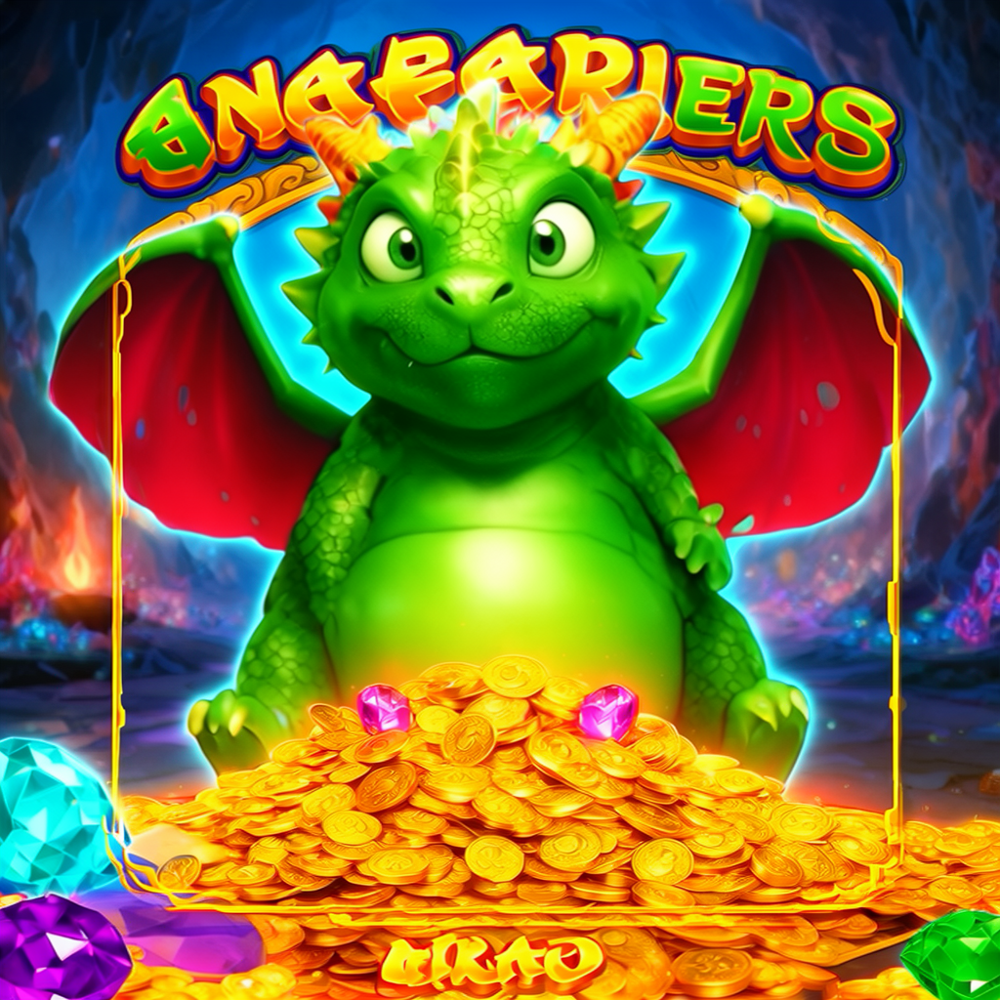
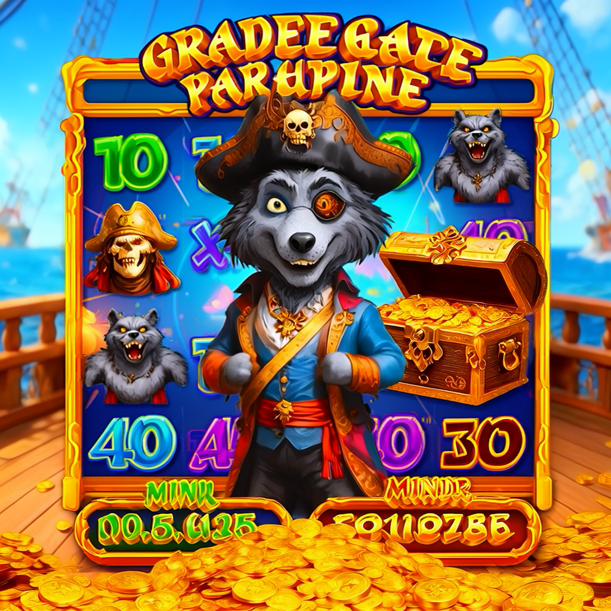

# 分层 LoRA 训练 + 多层组合 —— 实验报告

> **状态**:✅ 已验证,有产物 · 2026-07-06
> **产物**:S3 `s3://flux-poc-<account>-us-east-1/demo/comfyui-matrix/`;本地 `demo_output/comfyui-matrix/`
> **对应计划**:`docs/superpowers/plans/2026-06-29-layered-lora.md` Task 4/5/7

本报告为分层 LoRA(Style + Character)与多层组合的产物背书,结论如实记录,含未完全达标项。

---

## 1. 实验设置

### 训练产物(两个 rank-32 LoRA,各 390MB)

| 层 | 触发词 | caption 策略 | S3 路径 |
|----|--------|-------------|---------|
| Style | `slotstyle` | 详细 caption(角色/物体全部写入)→ 学习未被描述的共有特征 = 画风 | `outputs/lora-style-20260706-112005/flux-lora-poc.safetensors` |
| Character | `slotchar` | 稀疏 caption(仅留主体名)→ 更多视觉特征编码进 LoRA | `outputs/lora-char-20260706-134937/flux-lora-poc.safetensors` |

两层均取自**同一批 18 张游戏美术图**,仅 caption 策略不同(见 `poc/scripts/06_prepare_layers.py`),统一 rank-32 便于加权叠加。

### 推理设置

- 独立 g6e.4xlarge ComfyUI 实例(官方 fp8 预量化底模 + `LoraLoader` 串接),见 `poc/scripts/inference/comfy_gen.py`。
- 固定 seed=42、25 步、guidance=3.5、1024×1024、euler/simple。**唯一变量为 LoRA 配置**,以支持直接对照。

### 对照矩阵:3 主题 × 4 配置 = 12 图

- **主题**:`pirate`(新角色:海盗狼)、`dragon`(新角色:胖龙)、`mermaid`(自定义 IP:美人鱼)。
- **配置**:`base`(无 LoRA)、`style`(Style 1.0)、`char`(Character 1.0)、`combo`(Style 0.9 + Character 0.8)。

---

## 2. 观察结果

三个主题采用同一对照方式(固定 seed=42,唯一变量为 LoRA 配置):base → style → char → combo。mermaid 为自定义 IP,dragon / pirate 为训练集未包含的新角色,用于验证风格泛化。

### mermaid(自定义 IP)

| base | style | char | combo |
|------|-------|------|-------|
|  |  |  |  |

| 配置 | 观察 |
|------|------|
| base | 通用美人鱼立绘,独立角色,无目标游戏美术特征 |
| style | 同一主体呈现目标游戏美术风格:游戏面板网格、数字符号、UI 排布。风格迁移生效 |
| char | 亦带目标游戏美学,面板/图标框架更强(解耦讨论见第 3 节) |
| combo | 兼具画风与主体:美人鱼 + 完整游戏面板 + 金币/珍珠氛围,可直接作为素材 |

### dragon(新角色,泛化验证)

| base | style | char | combo |
|------|-------|------|-------|
|  |  |  |  |

| 配置 | 观察 |
|------|------|
| base | 通用插画风格的胖龙坐于金币堆,无目标游戏美术特征 |
| style | 高饱和游戏美术风格,金币堆与宝石氛围;触发词渗入顶部文字(见第 3 节) |
| char | 洞穴场景更聚焦主体,画风偏暖,面板元素弱于 style |
| combo | 兼具画风与主体:龙 + 金币 + 宝石 + UI 框架,风格与其余主题一致 |

### pirate(新角色,泛化验证)

| base | style | char | combo |
|------|-------|------|-------|
|  |  |  |  |

| 配置 | 观察 |
|------|------|
| base | 通用插画风格的海盗狼,船甲板 + 宝箱,无目标游戏美术特征 |
| style | 完整游戏面板:转轮网格、字母/数字符号、宝箱与金币,UI 排布明显 |
| char | 主体居中 + 面板背景,身份特征(独眼、三角帽)保留清晰 |
| combo | 兼具画风与主体:海盗狼 + 游戏面板 + 金币氛围,可直接作为素材 |

**泛化结论**:三个主题(含训练集未包含的 dragon / pirate)在 style 与 combo 下均继承目标游戏美术风格,表现一致(高饱和、游戏面板、UI 文字、金币氛围)。**风格 LoRA 可泛化至训练集外的任意新主体**,且风格迁移稳定,非过拟合于特定主体。

---

## 3. 结论(达标 / 未达标)

**✅ 达标:**
1. 两层 LoRA 均训出并生效——同 seed 下 base 与 style 输出 md5 不同,视觉差异显著(非静默跳过)。
2. 风格迁移对训练集外新角色泛化成功(dragon / pirate)。
3. combo 多层叠加可用,无加载报错(fp8 底模 + bf16 LoRA 兼容性验证通过)。

**⚠️ 未完全达标:**
1. **两层未完全解耦**。Style 与 Character 取自同一批图,`char`-only 亦带目标画风,非"纯主体身份"。完全解耦需 Character 层使用跨风格的同主体数据集,当前数据集不具备。现阶段两层差异主要来自 caption 密度导致的特征保留程度,而非画风与身份的干净切分。
2. **触发词渗入画面文字**。触发词偶被渲染为画面文本。目标美术本身含大量文字/数字元素,模型将触发词识别为可渲染文本。生产中应改用不易被当作文字的触发词,或在 caption 中进一步隔离。
3. **未做定量评分**。本轮为视觉对照,未运行 CLIP-score / 人工 rubric 网格。`07_compose_experiment.py` 的 3×3 权重网格定量评估仍为 TODO。

---

## 4. 建议

- **对照展示**:三个主题(mermaid / dragon / pirate)的 base→style→char→combo 四联对照,直观呈现"同一主体经 LoRA 后转为目标美术素材"及风格对新角色的泛化。
- **主体一致性的互补路径**:FLUX.2 原生多参考图(无需训练),见 `docs/superpowers/specs/2026-06-30-multiref-inference-design.md`。
- **表述口径**:按第 3 节说明"分层可训、组合可用、完全解耦受限于单一数据集",不声称完美双层解耦。

---

## 5. 复现

```bash
# 训练两层(需 GPU 训练机)
python3 poc/scripts/06_prepare_layers.py            # 生成 style / char 两套 caption
python3 poc/scripts/ctl.py train --layer style
python3 poc/scripts/ctl.py train --layer char

# 出对照矩阵(ComfyUI 推理机)
python3 poc/scripts/07_deploy_comfyui.py            # 自动拉取最新 style / char LoRA
python3 poc/scripts/inference/comfy_gen.py --config base  --out /exp/base
python3 poc/scripts/inference/comfy_gen.py --config style --out /exp/style
python3 poc/scripts/inference/comfy_gen.py --config char  --out /exp/char
python3 poc/scripts/inference/comfy_gen.py --config combo --out /exp/combo
```
